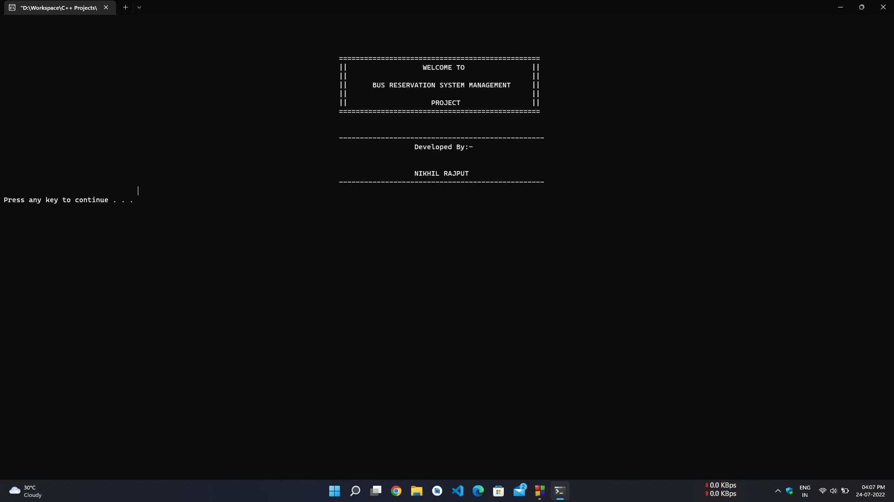
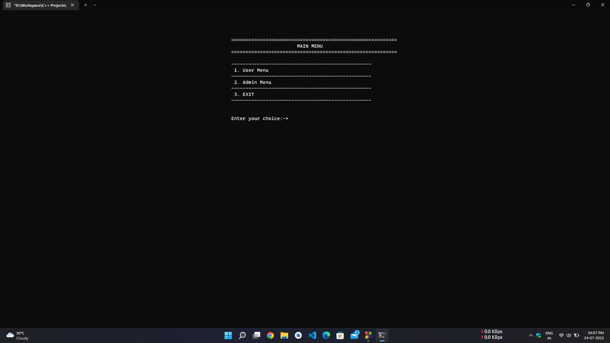
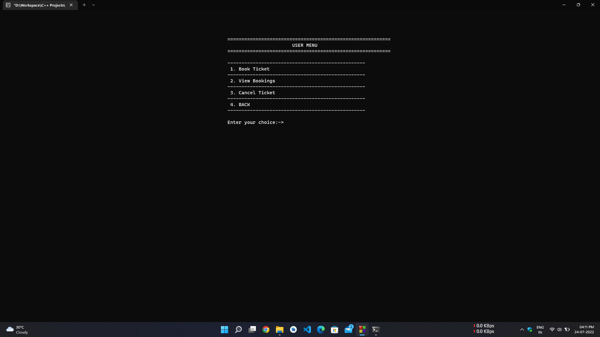
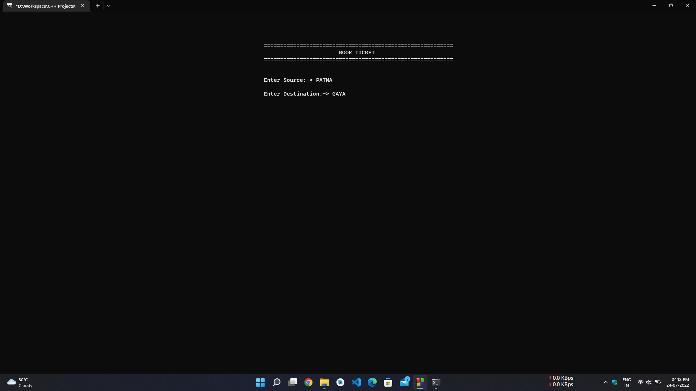
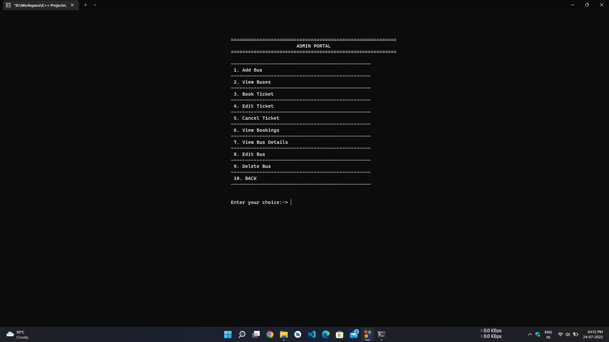
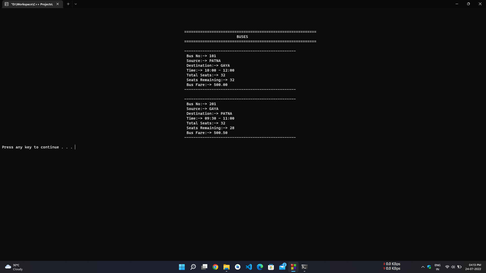

# Bus Reservation System Management with OOP and File Handling in C++

This repository contains the Bus Reservation System Management project developed using Object Oriented Programming (OOP) and File Handling concepts in C++.

[][repo]
[][repo]
[][repo]
[][repo]

[][repo]
[][issues]
[][pulls]
[][license]

## Table of Contents

- [Bus Reservation System Management with OOP and File Handling in C++](#bus-reservation-system-management-with-oop-and-file-handling-in-c)
  - [Table of Contents](#table-of-contents)
  - [Features](#features)
  - [Sceenshots](#sceenshots)
  - [Getting Started](#getting-started)
    - [Prerequisites](#prerequisites)
    - [Installation](#installation)
    - [Compilation](#compilation)
    - [Running the Application](#running-the-application)
    - [Admin Credentials](#admin-credentials)
  - [File Structure](#file-structure)
  - [Classes and Methods](#classes-and-methods)
    - [Bus Class](#bus-class)
    - [Reservation Class](#reservation-class)
    - [File Handling](#file-handling)
  - [How to Use](#how-to-use)
  - [Contributing](#contributing)
  - [License](#license)
  - [Sponsor Me](#sponsor-me)
  - [Connect With Me](#connect-with-me)
  - [Activities](#activities)

## Features

- **Bus Management**: Add, view, and remove bus details.
- **Reservation System**: Book, view, and cancel reservations.
- **File Handling**: Persist bus and reservation data using file handling techniques.
- **User Interface**: Command-line based user interface for interacting with the system.

## Sceenshots

- Welcome Screen



- Main Menu



- User Menu



- Book Ticket



- Admin Menu



- Bus List



## Getting Started

To get started with the development or usage of this project, follow the instructions below:

### Prerequisites

- A C++ compiler (such as g++, clang++)
- A suitable development environment (such as Visual Studio, Code::Blocks, or a text editor with command line tools)

### Installation

1. Clone this repository to your local machine:

    ```bash
    git clone https://github.com/nixrajput/bus-reservation-system-cpp.git
    ```

2. Navigate into the cloned repository directory:

    ```bash
    cd bus-reservation-system-cpp
    ```

### Compilation

To compile the project, you can use the following command in the terminal:

```bash
g++ -o BusReservationSystem main.cpp Bus.cpp Reservation.cpp
#or
clang++ main.cpp -o BusReservationSystem.exe
```

This command assumes you have `main.cpp`, `Bus.cpp`, and `Reservation.cpp` files. Modify it according to your actual file names.

### Running the Application

After successfully compiling the project, you can run the application using the command:

```bash
./BusReservationSystem
```

### Admin Credentials

Username : `admin`
Password : `pass`

## File Structure

The project directory typically contains the following files:

- `main.cpp`: The main entry point of the application.
- `Bus.h` and `Bus.cpp`: Bus class definition and implementation.
- `Reservation.h` and `Reservation.cpp`: Reservation class definition and implementation.
- `data/`: A directory containing data files for buses and reservations.
- `utils.h`: A file contains required utility functions.

## Classes and Methods

### Bus Class

This class manages bus details and includes the following methods:

- `void addBus()`: Adds a new bus.
- `void displayBuses()`: Displays all buses.
- `void removeBus()`: Removes a bus by ID.

### Reservation Class

This class manages reservations and includes the following methods:

- `void bookTicket()`: Books a new ticket.
- `void viewReservations()`: Displays all reservations.
- `void cancelReservation()`: Cancels a reservation by ID.

### File Handling

Data persistence is achieved using file handling concepts. The bus and reservation data are stored in separate files within the `data/` directory.

## How to Use

1. **Add a Bus**: Select the option to add a bus and enter the required details.
2. **View Buses**: Select the option to view all available buses.
3. **Remove a Bus**: Select the option to remove a bus and provide the bus ID.
4. **Book a Ticket**: Select the option to book a ticket and enter the required details.
5. **View Reservations**: Select the option to view all reservations.
6. **Cancel a Reservation**: Select the option to cancel a reservation and provide the reservation ID.

## Contributing

If you would like to contribute to this project, feel free to fork the repository, make your changes, and submit a pull request. Please follow the guidelines in the [CONTRIBUTING.md](CONTRIBUTING.md) file.

## License

This project is licensed under the MIT License - see the [LICENSE](LICENSE) file for details.

## Sponsor Me

By sponsoring my efforts, you're not merely contributing to the development of my projects; you're investing in its growth and sustainability.

Your support empowers me to dedicate more time and resources to improving the project's features, addressing issues, and ensuring its continued relevance in the rapidly evolving landscape of technology.

Your sponsorship directly fuels innovation, fosters a vibrant community, and helps maintain the project's high standards of quality. Together, we can shape the future of the projects and make a lasting impact in the open-source community.

Thank you for considering sponsoring my work!

[](https://github.com/sponsors/nixrajput)

[](https://ko-fi.com/nixrajput)

[](https://www.buymeacoffee.com/nixrajput)

## Connect With Me

[][github]
[][linkedin]
[][instagram]
[][twitter]
[][telegram]
[][gmail]

## Activities


[github]: https://github.com/nixrajput
[twitter]: https://twitter.com/nixrajput07
[instagram]: https://instagram.com/nixrajput
[linkedin]: https://linkedin.com/in/nixrajput
[telegram]: https://telegram.me/nixrajput
[gmail]: mailto:nkr.nikhil.nkr@gmail.com

[repo]: https://github.com/nixrajput/bus-reservation-system-cpp
[issues]: https://github.com/nixrajput/bus-reservation-system-cpp/issues
[pulls]: https://github.com/nixrajput/bus-reservation-system-cpp/pulls
[license]: https://github.com/nixrajput/bus-reservation-system-cpp/blob/master/LICENSE
